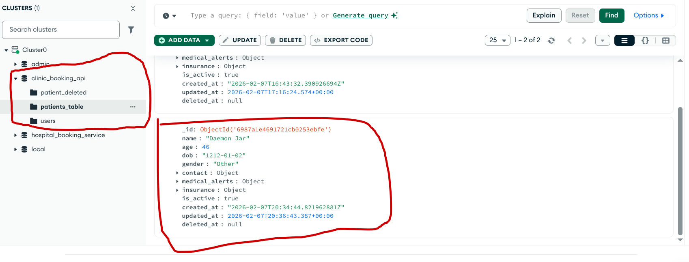

# Helm Chart for Clinic API

## Overview

This Helm chart deploys the `clinic-booking-api` backend, a Rust-based application built with Actix Web that provides API services for clinic booking operations. The application integrates with MongoDB for data persistence and is designed to run on Kubernetes clusters.


For more details, visit the [GitHub repository](https://github.com/dayo777/clinic_booking_api).

> the [settings_dev.toml](templates/secret.yaml) file is used to pass values needed for the App to access credentials.

## Prerequisites
- Minikube
- Kubernetes cluster (version 1.30+)
- Helm (version 3.0+)
- kubectl configured to access your cluster
- MongoDB Atlas (for database persistence)
- Jaegar Endpoint (for collecting logs)

## Installation

### Clone the Repository

Clone the repository containing this Helm chart:

```bash
git clone https://github.com/dayo777/helm-clinic-api.git
cd helm-clinic-api
```

### Install the Chart

1. To install the chart with the release name `clinic-release-dev` in the `dev` namespace:
```bash
kubectl create namespace dev
helm install clinic-release-dev . -f values_dev.yaml -n dev
```

2. Enable Minikube tunnel to act as a network bridge:
```bash
minikube tunnel
```

3. Retrieve the External-IP from the SVC
```bash
k get svc -n dev
```

4. As an example, if the IP is `10.109.3.4`, access it through the BaseEndpoint below. 
```bash
10.109.3.4:8080/api
```

> Do not forget to add the required headers `x-api-version: 1' & `Content-Type: application/json`



## Configuration

The following table lists the configurable parameters of the Helm Clinic API chart and their default values.

| Parameter | Description | Default              |
|-----------|-------------|----------------------|
| `image.repo` | Docker image repository | `dayo777`            |
| `image.name` | Docker image name | `clinic-booking-api` |
| `image.tag` | Docker image tag | `main`               |
| `image.pullPolicy` | Image pull policy | `Always`             |
| `service.type` | Kubernetes service type | `LoadBalancer`       |
| `service.port` | Service port | `8080`               |
| `mongodb.enabled` | Enable MongoDB dependency | `false`              |
| ... | ... | ...                  |

Specify each parameter using the `--set key=value[,key=value]` argument to `helm install`. For example:

## Common Commands

### List Releases

```bash
helm list --all-namespaces
```

### Lint the Chart

```bash
helm lint .
```

### Upgrade a Release

```bash
helm upgrade clinic-release-dev . -n dev
```

### Uninstall a Release

```bash
helm uninstall clinic-release-dev -n dev
```

### View Templated Manifests

```bash
helm template .
```

### View Templated Manifests with Dev Values

```bash
helm template . -f values-dev.yaml
```

### View Templated Manifests with Prod Values

```bash
helm template . -f values-prod.yaml
```

### Check Release Status

```bash
helm status clinic-release-dev -n dev
```

### Rollback a Release

```bash
helm rollback clinic-release-dev 1 -n dev
```

## Testing

Run the included tests:

```bash
helm test clinic-release-dev -n dev
```
